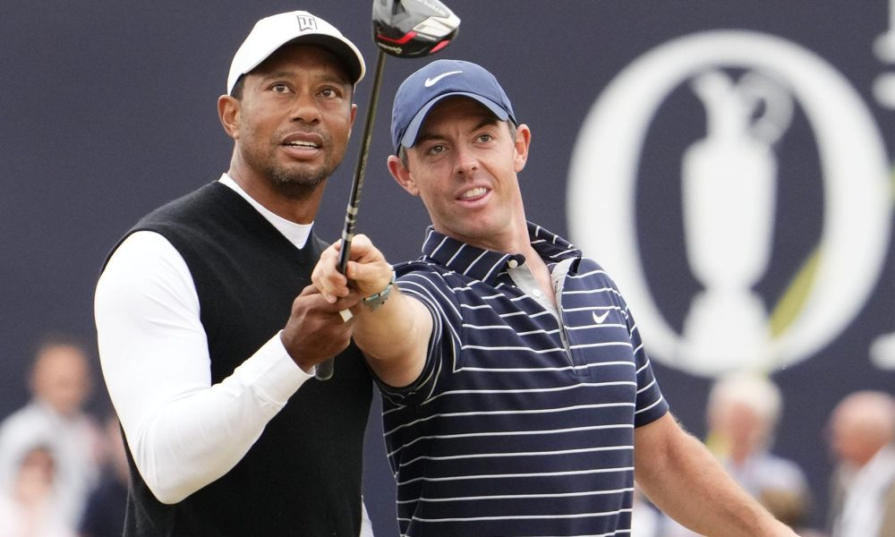
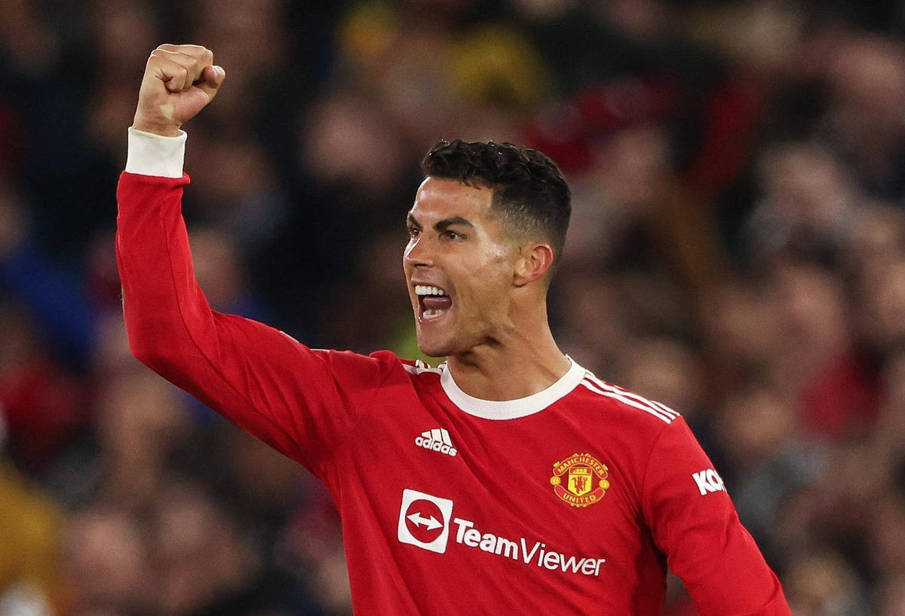
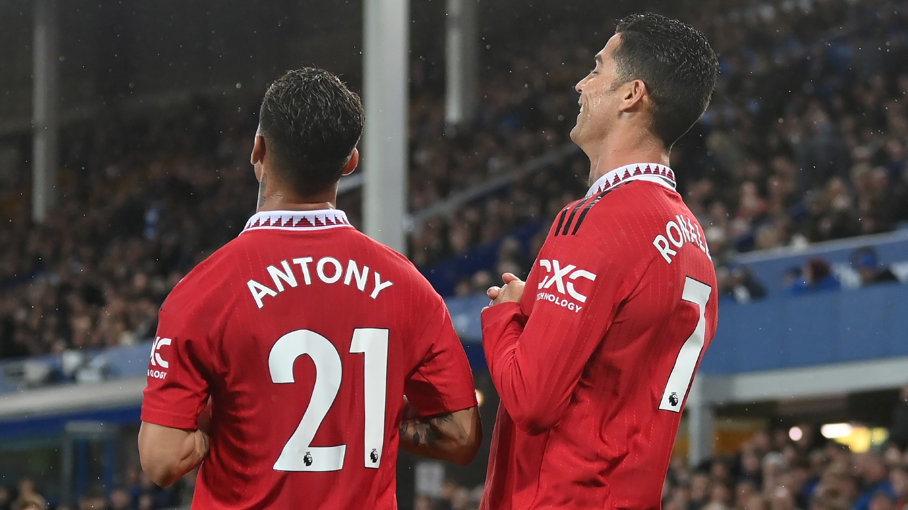

## Typography CSS library
**Author:** Tomáš Chramosta
## Demo site
Link to **[demo](https://pslib-cz.github.io/2022l4web-css-typographic-library-Toumas29/)** site for preview.
## Description 
This website was created for easy css aplication on your html codes. It contains some basic designs for the most important things.
## Summary 
1. [Implementation](#Implementation)
2. [Headings](#Headings)
3. [Lists](#Lists)
4. [Table](#Table)
5. [PictureGallery](#PictureGgallery)
## Implementation
1. Download CSS file **[typography.css](https://github.com/pslib-cz/2022l4web-css-typographic-library-Toumas29/blob/master/docs/css/typography.css)**.
2. Insert downloaded file in your project.
3. Link downloaded file with HTML.
## Headings
U can use up to 6 headings with size and weight changes(all mobile first ready):
*  `<h1>` size 32px, weight 600
*  `<h2>` size 28px, weight 400
*  `<h3>` size 24px, weight 400
*  `<h4>` size 20px, weight 300
*  `<h5>` size 19px, weight 300
*  `<h5>` size 18px, weight 300
## Lists
### Unordered list
```html
<ul>
        <li>Richard Hammond
            <ul>
                <li>Born 1969</li>
            </ul>
        </li>
        <li>Jeremy Clarkson
            <ul>
                <li>Born 1960</li>
            </ul>
        </li>
        <li>James May
            <ul>
                <li>Born 1963</li>
            </ul>
        </li>
    </ul>
```
### Ordred list
```html
    <ol>
        <li>Karim Benzema</li>
        <li>Sadio Mane</li>
        <li>Kevin De Bruyne</li>
        <li>Robert Lewandowski</li>
        <li>Mohamed Salah</li>
        <li>Kylian Mbappe</li>
    </ol>
```
## Table
We are using tags tr, th, td when making using table. Table is made of tag table, which is divided into tr(row), then cells th,td.
### Table example
```html
<table class="table__data">
        <tr>
            <th>Player</th>
            <th>Place of birth</th>
            <th>Tour wins</th>
            <th>Major wins</th>
        </tr>
        <tr>
            <td>Tiger Woods</td>
            <td>USA</td>
            <td>82</td>
            <td>15</td>
        </tr>
        <tr>
            <td>Jack Nicklaus</td>
            <td>USA</td>
            <td>73</td>
            <td>18</td>
        </tr>
        <tr>
            <td>Rory McIlroy</td>
            <td>NIR</td>
            <td>22</td>
            <td>4</td>
        </tr>
        <tr>
            <td>Lukáš Martínek</td>
            <td>CZE</td>
            <td>0</td>
            <td>0</td>
        </tr>
    </table>
```
## Picture gallery
### Single picture
If you have only one picture use this gallery:
```html
<figure class="pictures__block">
       <a href="./foto/USATSI_18684237-1-e1661112368436.jpg">
        
        <figcaption>The golf goats</figcaption>
    </a>
      </figure>
```
### Multiple pictures
If you have more than one picture use this gallery:
```html
   <div class="pictures__gallery">
      <figure class="pictures__block">
        <a href="./foto/ronaldo1.jpg">
            
            <figcaption>CR7</figcaption>
        </a>
        </figure>
        <figure class="pictures__block">
        <a href="./foto/ronaldo2.jpg">
            
            <figcaption>Suiiiii</figcaption>
        </a>
        </figure>
        <figure class="pictures__block">
        <a href="./foto/ronaldo3.jpg">
            
            <figcaption>CR7 with Antony</figcaption>
        </a>
      </figure>
    </div>
```
